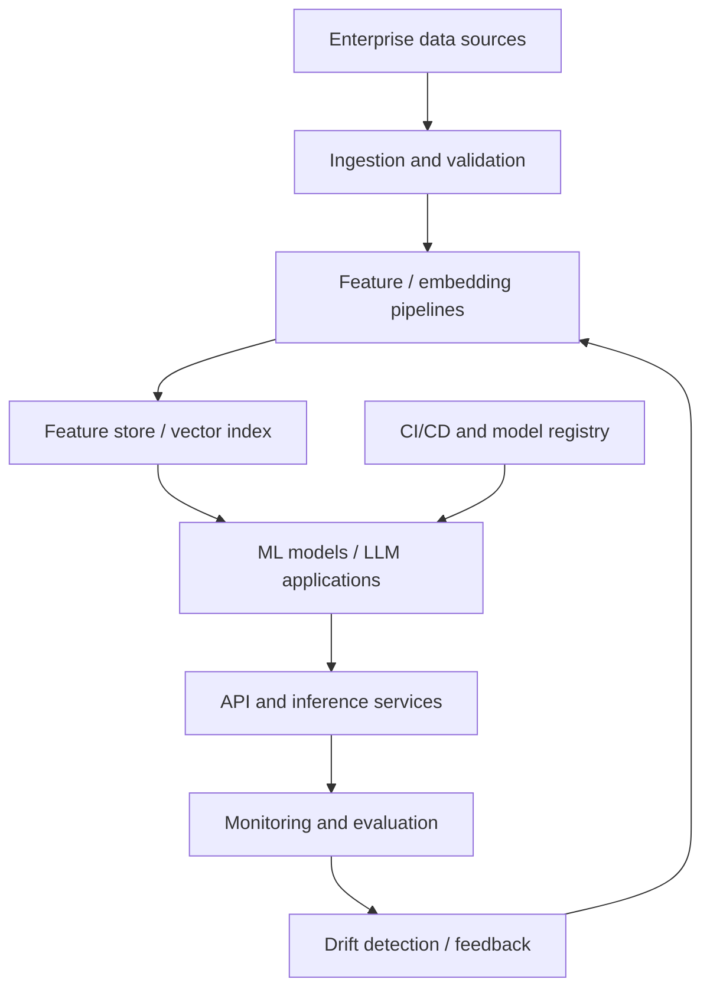
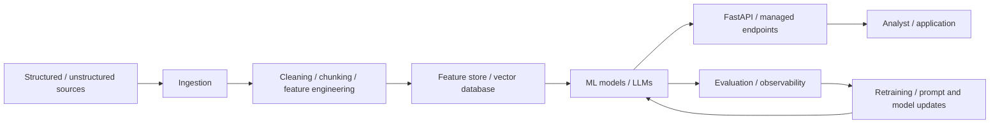
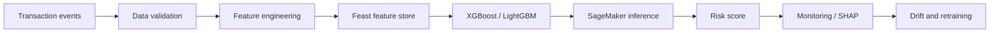
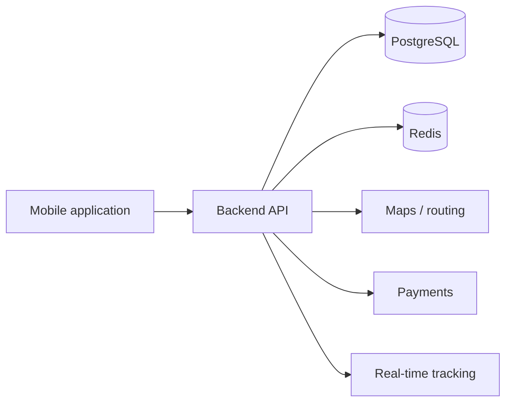
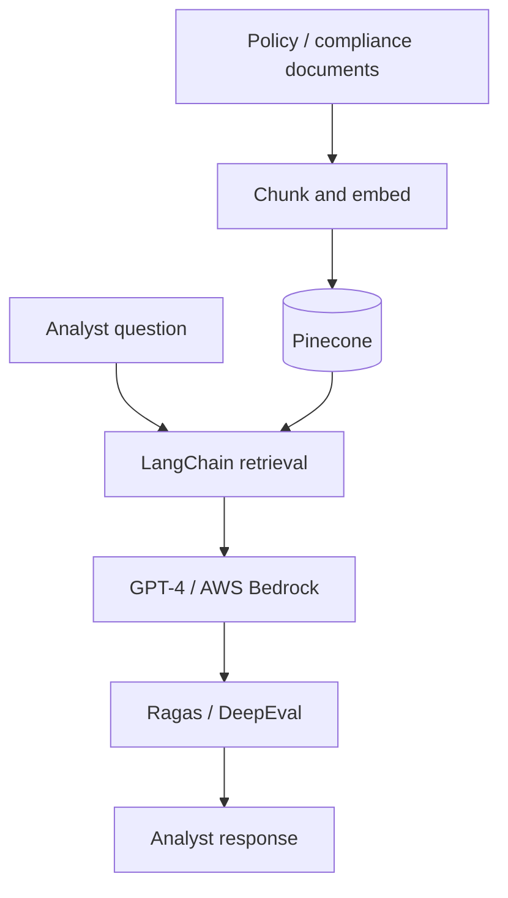

<div align="center">

# VENKATA SAI DIVYA HANUMANTHU

### AI/ML Engineer | Generative AI | Agentic AI | RAG | MLOps | Full-Stack Systems

**Engineering production AI systems from experimentation to deployment.**

[](https://www.linkedin.com/in/divya-v190419) [](https://mail.google.com/mail/?view=cm&fs=1&to=saidivyahanumanthu070802%40gmail.com) [](tel:+19089443956)


</div>


---

<p align="center"></p>


---

| 🤖 **AI ENGINEERING** | 📈 **PRODUCTION IMPACT** | 🧩 **PRODUCT BUILDER** |
|:---|:---|:---|
| 3.5+ years in applied ML and GenAI | Fraud platform supporting **12M+ transactions/day** | Java / Spring Boot / React SaaS dashboard |
| RAG, LLM evaluation, fine-tuning | **31%** fewer fraud losses; **27%** fewer false positives | JWT/RBAC, REST APIs, PostgreSQL, AWS |
| SageMaker, Bedrock, LangChain, Pinecone | **2M+** compliance documents searchable | CNN-based MRI abnormality detection |
| Responsible AI, SHAP, MLOps | **46%** less analyst research time | End-to-end model and application delivery |

*Impact metrics describe systems I contributed to, as documented in my resume.*


---

<p align="center"></p>


---

```text
Divya Hanumanthu
├── Role: AI/ML Engineer
├── Specialization
│   ├── Production ML and fraud intelligence
│   ├── Enterprise RAG and LLM evaluation
│   ├── Fine-tuning: LoRA / QLoRA
│   ├── Agentic AI and orchestration
│   └── MLOps, monitoring and responsible AI
├── Engineering
│   ├── Python / SQL / Java / Bash
│   ├── FastAPI / Spring Boot / React
│   ├── AWS / Azure / GCP
│   └── Docker / Kubernetes / Terraform
└── Approach: measurable impact, reliable deployment, explainable models
```


---

<p align="center"></p>


---

| Category | Status | Details |
|:---|:---|:---|
| Location | 🇺🇸 United States | Open to relocation |
| Professional focus | AI/ML engineering | GenAI, RAG, MLOps, full-stack systems |
| Collaboration | Cross-functional | Engineering, product, risk and compliance |
| Contact | Direct | [Email](https://mail.google.com/mail/?view=cm&fs=1&to=saidivyahanumanthu070802%40gmail.com) · [LinkedIn](https://www.linkedin.com/in/divya-v190419) |

*For current interview availability, work arrangements, or start date, please contact me directly.*


---

<p align="center"></p>


---

<div align="center">

   

**AI/ML Engineer · Generative AI Engineer · Applied ML Engineer · MLOps Engineer · AI Platform Engineer**

</div>


---

<p align="center"></p>


---

| AI system | Scope and implementation | Reported outcome |
|:---|:---|:---|
| ⚡ Real-time fraud detection | XGBoost, LightGBM, SageMaker endpoints, feature store | 12M+ daily transactions; sub-80ms p99 latency |
| 📚 Enterprise RAG assistant | LangChain, GPT-4, Bedrock, Pinecone | 2M+ documents; 46% lower analyst research time |
| 🧪 LLM evaluation | Ragas, DeepEval, 5,000+ test cases | Hallucination rate **18% → 4%** |
| 🧠 LLM fine-tuning | Llama 3, Mistral 7B, LoRA/QLoRA, PEFT | F1 **0.81 → 0.93** |
| 🚀 Production MLOps | SageMaker Pipelines, MLflow, Docker, EKS, Actions | Release cycle **3 weeks → <48 hours** |
| 🛡️ Monitoring & governance | Evidently AI, SageMaker Monitor, SHAP | Supported **99.95%** reliability SLA |


---

### Enterprise AI architecture

*Representative architecture based on technologies and workflows in my resume.*


---

<p align="center"></p>


---

| Metric | Impact |
|:---|---:|
| Transactions supported by fraud platform | **12M+ / day** |
| Fraud-loss reduction contributed to | **31%** |
| False-positive reduction contributed to | **27%** |
| Feature store scale | **350+ ML features** |
| Feature delivery time | **6 weeks → 5 days** |
| RAG knowledge base | **2M+ documents** |
| Analyst research time reduction | **46%** |
| LLM hallucination rate | **18% → 4%** |
| Monthly document processing (previous role) | **1.5M+ documents** |
| Inference throughput optimization | **3.4×** |


---

<p align="center"></p>


---

| Domain | Technologies |
|:---|:---|
| **GenAI / LLMs** | LangChain, LangGraph, LlamaIndex, GPT-4, AWS Bedrock, Hugging Face, LoRA, QLoRA, Ragas, DeepEval |
| **ML / Deep Learning** | PyTorch, TensorFlow, scikit-learn, XGBoost, LightGBM, BERT, LayoutLMv3, ONNX |
| **Retrieval / Search** | Pinecone, FAISS, Weaviate, embeddings, semantic search, reranking |
| **MLOps / Infrastructure** | SageMaker, MLflow, Feast, Evidently AI, Docker, Kubernetes, GitHub Actions, Terraform, Triton |
| **Data Engineering** | Spark, PySpark, Kafka, Airflow, Databricks, Delta Lake, Glue, Snowflake |
| **Cloud** | AWS, Azure ML, AKS, GCP Vertex AI |
| **Application Engineering** | Python, Java, SQL, Bash, FastAPI, Spring Boot, React, PostgreSQL |
| **Governance** | SHAP, bias audits, model cards, model validation, regulatory compliance |


---

<p align="center"></p>


---

| Competency | Applied context | Evidence |
|:---|:---|:---|
| Fraud ML | Production inference | XGBoost / LightGBM on SageMaker |
| Enterprise RAG | Document retrieval and answer generation | LangChain, Bedrock, Pinecone |
| LLM evaluation | Faithfulness, relevancy, hallucination | Ragas / DeepEval |
| Model fine-tuning | Parameter-efficient adaptation | LoRA / QLoRA, Llama 3, Mistral |
| Feature engineering | Online/offline feature pipelines | Databricks, PySpark, Feast |
| MLOps | Automated releases and monitoring | MLflow, Actions, EKS, Evidently |
| Full-stack engineering | Multi-tenant SaaS platform | Java, React, PostgreSQL, AWS |


---

<p align="center"></p>


---

<div align="center">


</div>

*GitHub statistics are fetched live from third-party badge services and reflect public GitHub activity, not resume experience.*


---

<p align="center"></p>


---




---

<p align="center"></p>


---


**Reported production context:** 12M+ transactions/day · p99 below 80ms · 31% fewer fraud losses · 27% fewer false positives. These are team/system outcomes to which I contributed.


---

<p align="center"></p>


---

| Period | Role | Highlights |
|:---|:---|:---|
| **Jul 2025 – Present** | **AI/ML Engineer — AIG, USA** | Fraud intelligence, RAG, LLM evaluation, fine-tuning, production MLOps |
| **Feb 2025 – May 2025** | **AI/ML Engineer Intern — AIG, USA** | Fraud detection, feature engineering, MLOps |
| **Jul 2021 – Aug 2023** | **Associate Software Engineer – AI/ML — Goldman Sachs, India** | Document AI, NLP, churn models, inference optimization, ML deployment |

**Education:** M.S. Computer Science — New Jersey Institute of Technology · B.Tech Computer Science & Engineering — Dayananda Sagar University.


---

<p align="center"></p>


---

| Project / system | Impact or purpose | Stack | Basis |
|:---|:---|:---|:---|
| 🚗 **YOO RideShare Platform** | Rideshare and carpool product concept | React Native, Node.js, PostgreSQL, Redis, Maps, Stripe | **Reference example only — not claimed as my project** |
| 💳 **Fraud Detection Platform** | Enterprise-scale transaction risk scoring | Python, XGBoost, LightGBM, SageMaker, Feast | **Resume-documented work** |
| 📚 **Enterprise RAG Assistant** | Compliance and policy document intelligence | LangChain, GPT-4, Bedrock, Pinecone | **Resume-documented work** |
| 🤖 **Agentic AI Workflows** | Orchestration and tool-based workflows | LangGraph, LlamaIndex, tool calling | **Skills in resume; no standalone project outcome claimed** |
| ⚙️ **MLOps Pipelines** | Training, evaluation, deployment, monitoring | Docker, Kubernetes, MLflow, GitHub Actions | **Resume-documented work** |
| 📈 **Time Series Forecasting** | Forecasting and trend analysis concept | ARIMA, Prophet, LSTM | **Reference example only — not claimed as my project** |
| 🧩 **Multi-Tenant SaaS Dashboard** | Subscription, billing, tenant isolation | Java 21, Spring Boot, React, PostgreSQL, AWS | **Resume project** |
| 🧠 **Brain Abnormality Detection** | MRI classification, 92% accuracy on 300+ images | Python, CNN, VGG16, VGG19 | **Resume project** |


---

<p align="center"></p>


---

> **Reference architecture showcase only.** This section reproduces the example project's placement and concept from the reference profile. It is **not** presented as a project I built.

| Product vision (reference) | System layers (reference) |
|:---|:---|
| A rideshare and carpool platform with driver/passenger modes, route matching, scheduled rides, real-time tracking, and safety features. | Mobile: React Native / Expo / TypeScript<br>Backend: Node.js / Express<br>Data: PostgreSQL / Redis<br>Integrations: Google Maps / Stripe / OTP<br>Real-time: WebSockets / notifications |




---

<p align="center"></p>


---

| Business impact | ML lifecycle |
|:---|:---|
| • 12M+ transactions/day<br>• 31% reduction in fraud losses<br>• 27% reduction in false positives<br>• Sub-80ms p99 inference<br>• SHAP explainability and monitoring | • Transaction ingestion<br>• Feature engineering / Feast<br>• XGBoost and LightGBM training<br>• SageMaker model serving<br>• Model Monitor / Evidently AI<br>• Drift alerts and retraining |

*The listed outcomes describe a production platform I contributed to at AIG.*


---

<p align="center"></p>


---

| Platform capabilities | RAG system flow |
|:---|:---|
| • Search over **2M+ policy and compliance documents**<br>• LangChain and Bedrock-based LLM integration<br>• Embedding-based retrieval with Pinecone<br>• Ragas / DeepEval quality evaluation<br>• Hallucination rate reduced **18% → 4%**<br>• Agentic workflow tools are part of my skills, not a separately verified deployment | **Sources** → policies / compliance documents<br>**Processing** → chunking / embeddings<br>**Indexing** → Pinecone<br>**Retrieval** → semantic search<br>**Generation** → GPT-4 / Bedrock<br>**Evaluation** → Ragas / DeepEval<br>**Response** → analyst-facing answers |




---

<p align="center"></p>


---

```text
2026 Focus Areas
├── Enterprise RAG and retrieval quality
├── Agentic AI and tool orchestration
├── Production ML and fraud detection
├── LLM evaluation and fine-tuning
├── Reliable MLOps and model monitoring
├── Responsible AI and explainability
└── Full-stack AI application engineering
```


---

<p align="center"></p>


---

```text
Build for measurable impact
├── Ground models in validated data
├── Evaluate before deployment
├── Monitor production behavior
├── Make decisions explainable
├── Automate repeatable workflows
├── Secure data and tenant boundaries
└── Improve systems from observed results
```


---

<p align="center"></p>


---

<div align="center">


*This animation appears after the included GitHub Actions workflow has run successfully.*

</div>


---

<p align="center"></p>


---

<div align="center">

[](https://mail.google.com/mail/?view=cm&fs=1&to=saidivyahanumanthu070802%40gmail.com)
[](https://www.linkedin.com/in/divya-v190419)
[](https://github.com/divyanarayana190)

### Building AI systems that move from prototype to production 🚀


</div>


<sub>✉️ Email: **saidivyahanumanthu070802@gmail.com** · [Compose in Gmail](https://mail.google.com/mail/?view=cm&fs=1&to=saidivyahanumanthu070802%40gmail.com) · [Open default email app](mailto:saidivyahanumanthu070802@gmail.com)</sub>
