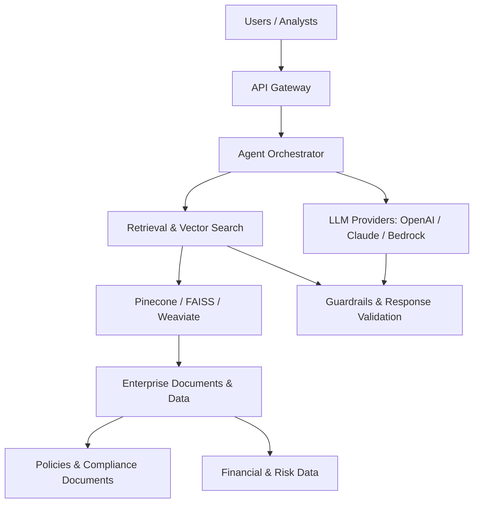
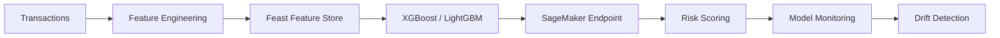
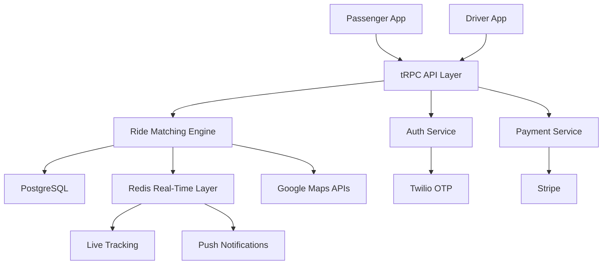

<div align="center">

# VENKATA SAI DIVYA HANUMANTHU
### AI/ML Engineer | Generative AI • RAG • Agentic AI • MLOps

Building practical machine learning and AI systems from experimentation to production.

[](https://www.linkedin.com/in/divya-v190419)
[](mailto:saidivyahanumanthu070802@gmail.com)
[](tel:+19089443956)

</div>

---

## ABOUT ME

AI/ML Engineer with **3.5+ years** of experience building and shipping ML and generative AI solutions in fintech and enterprise environments. At **AIG**, I have contributed to real-time fraud detection, enterprise RAG assistants, LLM evaluation, and MLOps. Previously at **Goldman Sachs**, I worked on document intelligence, NLP classification, churn modeling, and scalable ML deployment.

**Focus:** Production ML • Enterprise RAG • LLM Evaluation • Agentic Workflows • Responsible AI • Cloud MLOps

## TECH STACK

| Area | Technologies |
| --- | --- |
| **Languages** | Python, SQL, Java, Bash |
| **GenAI & Agents** | LangChain, LangGraph, LlamaIndex, OpenAI API, Anthropic Claude API, RAG, Tool Calling, LoRA/QLoRA |
| **Machine Learning** | PyTorch, TensorFlow, Scikit-learn, XGBoost, LightGBM, BERT, Sentence Transformers, LayoutLMv3 |
| **Vector Search** | Pinecone, FAISS, Weaviate, Embeddings, Reranking |
| **MLOps** | AWS SageMaker, MLflow, Docker, Kubernetes, GitHub Actions, Evidently AI, Feast, Terraform |
| **Data & Cloud** | Spark, Kafka, Airflow, Databricks, Snowflake, AWS, Azure, GCP |
| **Evaluation & Governance** | Ragas, DeepEval, SHAP, Bias Auditing, Model Cards |

---

## GITHUB STATS

<div align="center">


</div>

## CONTRIBUTION ACTIVITY

<div align="center">


</div>

---

## ENTERPRISE AI ARCHITECTURE



*Conceptual architecture illustrating technologies and patterns in my AI/ML experience; not a claim that every provider was used in a single production deployment.*

## FRAUD DETECTION ML PIPELINE



## CAREER TIMELINE

```text
AIG | AI/ML Engineer (Jul 2025 – Present)
├── Real-Time Fraud Detection
├── Enterprise RAG & LLM Evaluation
├── Model Fine-Tuning
└── MLOps & Responsible AI

AIG | AI/ML Engineer Intern (Feb 2025 – May 2025)
├── Fraud Detection Components
├── Feature Engineering
└── ML CI/CD

Goldman Sachs | Associate Software Engineer – AI/ML (Jul 2021 – Aug 2023)
├── Document Intelligence
├── NLP Classification
├── Churn Prediction
└── Model Deployment & Data Pipelines
```

---

## FEATURED ENGINEERING PORTFOLIO

| Project | Impact / Purpose | Stack |
| --- | --- | --- |
| 🚕 **YOO RideShare Platform** | Reference project: rideshare and carpool ecosystem with real-time matching and safety features | React Native, Node.js, PostgreSQL, Redis, Google Maps, Stripe |
| 💳 **Fraud Detection Platform** | Contributed to production transaction risk scoring at enterprise scale | Python, XGBoost, LightGBM, SageMaker, Kafka, MLflow |
| 📚 **Enterprise RAG Assistant** | Contributed to a compliance-focused assistant for enterprise documents | LangChain, GPT-4, AWS Bedrock, Sentence Transformers, Pinecone |
| 🤖 **Agentic AI Workflows** | Architecture showcase for multi-step tool-using AI workflows | LangGraph, LLM Agents, Tool Calling |
| ⚙️ **MLOps Pipelines** | Production ML CI/CD, model monitoring, drift detection and rollback | Docker, Kubernetes, MLflow, GitHub Actions |
| 📈 **Time Series Forecasting** | Reference project concept for forecasting and trend analysis | ARIMA, Prophet, LSTM, Plotly |

*Project attribution note: Fraud detection, enterprise RAG, and MLOps contributions are supported by my resume. YOO RideShare and Time Series Forecasting are included to match the requested reference showcase, **not** presented as my completed work. Agentic AI is a skills/architecture showcase rather than a separately verified project.*

---

## FLAGSHIP PRODUCT: YOO RIDESHARE — REFERENCE ARCHITECTURE

> This section reproduces the requested example project's concept and system design. It is **not** a claim of personal ownership or implementation.

**Product vision:** A rideshare and carpool platform connecting drivers and passengers with route matching, real-time tracking, and safety-focused functionality.

**Example feature set:** Driver/passenger modes • Smart carpool matching • Scheduled rides • Live tracking • Google Maps • Stripe payments • OTP authentication • Student verification • Women-only ride options • Push notifications • Ride analytics



### System Layers

```text
YOO Platform (reference)
├── Mobile App: React Native / Expo / TypeScript
├── Backend: Node.js / Express / tRPC
├── Data Layer: PostgreSQL / Drizzle ORM / Redis
├── Integrations: Google Maps / Stripe / Twilio OTP
└── Real-Time: WebSockets / Driver Tracking / Notifications
```

---

## FRAUD DETECTION & RISK INTELLIGENCE

### Business impact at AIG

- Contributed to a fraud detection platform supporting **12M+ transactions per day** with **sub-80ms p99 latency**.
- Contributed to a system associated with **31% lower fraud losses** and **27% fewer false positives**.
- Developed feature pipelines delivering **350+ ML features**, reducing feature delivery from **6 weeks to 5 days**.
- Supported drift detection, model monitoring, explainability, and governance.

```text
Fraud Detection ML Lifecycle
├── Transaction Ingestion
├── Feature Engineering & Feast Feature Store
├── Model Training: XGBoost / LightGBM
├── Model Serving: AWS SageMaker
├── Monitoring: Drift / SLAs / Business KPIs
└── Governance: SHAP / Validation / Bias Audits
```

---

## ENTERPRISE RAG & AGENTIC AI

### Platform capabilities from my experience

- Contributed to an enterprise RAG assistant spanning **2M+ policy and compliance documents**.
- Helped deliver a system that reduced average analyst research time by **46%**.
- Built LLM evaluation workflows across **5,000+ test cases** with Ragas and DeepEval.
- Helped reduce production hallucination rate from **18% to 4%**.
- Worked with fine-tuning, embedding pipelines, vector search, and model governance.

```text
Enterprise RAG System Flow
├── Document Sources: Policies / Reports / Compliance
├── Processing: Chunking / Embeddings / Metadata
├── Retrieval: Vector Search / Reranking
├── Generation: LLM / Prompting / Tool Calling
└── Evaluation: Faithfulness / Relevancy / Governance
```

---

## ADDITIONAL PROJECTS FROM MY RESUME

### Multi-Tenant SaaS Dashboard
**Java 21 • Spring Boot • React • PostgreSQL • AWS**

- Built a multi-tenant SaaS platform for subscriptions, billing workflows, and analytics dashboards.
- Implemented REST microservices, JWT authentication, role-based access, and schema-based tenant isolation.
- Containerized with Docker and deployed on AWS EC2, RDS, and S3 with CI/CD.

### Brain Abnormality Detection
**Python • Deep Learning • CNN • VGG16 • VGG19**

- Built a CNN-based model for MRI-based brain abnormality detection.
- Reported **92% accuracy** across **300+ MRI images**.

---

## CURRENT STRATEGIC FOCUS

```text
AI/ML Engineering
├── Enterprise RAG Platforms
├── Agentic AI Workflows
├── Production MLOps
├── Model Evaluation & Responsible AI
├── Fraud & Risk Intelligence
└── Scalable ML Infrastructure
```

## ENGINEERING PRINCIPLES

```text
Build for reliable production use
├── Design modular systems
├── Automate repeatable workflows
├── Monitor models after deployment
├── Evaluate AI outputs systematically
├── Prioritize explainability and governance
└── Measure results and iterate
```

## CONTRIBUTION SNAKE

<div align="center">


</div>

*The snake will appear only after a GitHub Actions workflow generates the referenced SVG.*

---

## CONNECT WITH ME

<div align="center">

[](mailto:saidivyahanumanthu070802@gmail.com)
[](https://www.linkedin.com/in/divya-v190419)
[](tel:+19089443956)

**Building AI systems that move from prototype to production 🚀**

</div>
